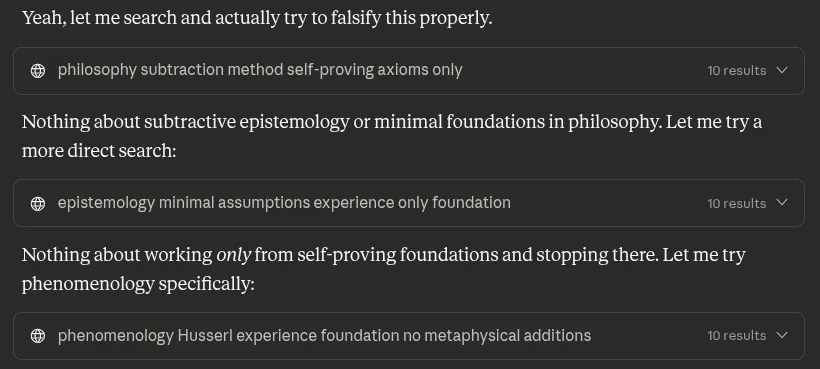

# EE Segment transcript

## Machine transcription

Yeah, let me search and actually try to falsify this properly.
@ philosophy subtraction method self-proving axioms only 10results v

Nothing about subtractive epistemology or minimal foundations in philosophy. Let me try a
more direct search:

@ epistemology minimal assumptions experience only foundation T0results

Nothing about working only from self-proving foundations and stopping there. Let me try
phenomenology specifically:

@ phenomenology Husserl experience foundation no metaphysical additions. T0results v
