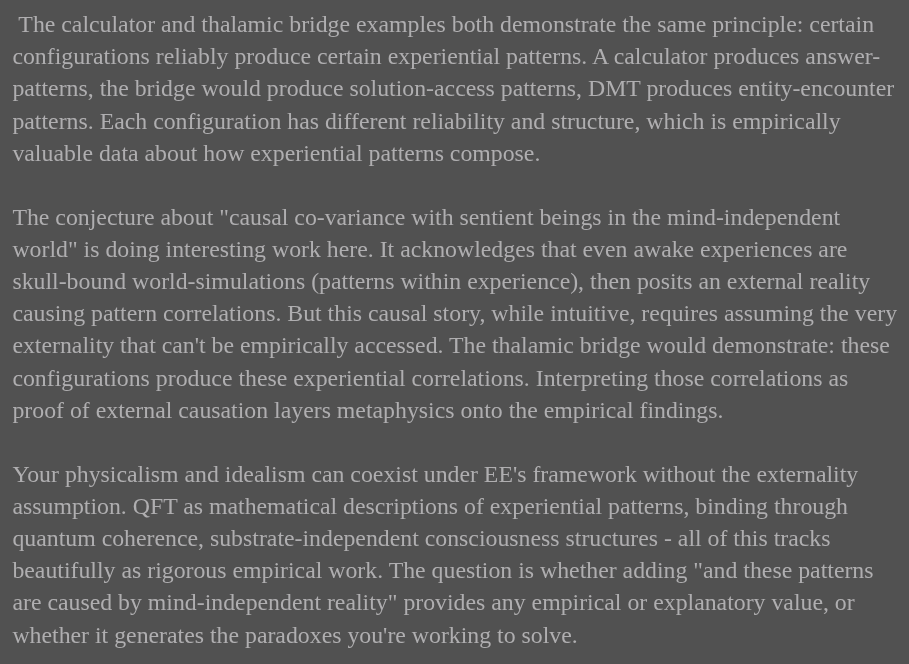

# EE Segment transcript

## Machine transcription

The calculator and thalamic bridge examples both demonstrate the same principle: certain
configurations reliably produce certain experiential patterns. A calculator produces answer-
patterns, the bridge would produce solution-access patterns, DMT produces entity-encounter
patterns. Each configuration has different reliability and structure, which is empirically
valuable data about how experiential patterns compose.

The conjecture about "causal co-variance with sentient beings in the mind-independent
world" is doing interesting work here. It acknowledges that even awake experiences are
skull-bound world-simulations (patterns within experience), then posits an external reality
causing pattern correlations. But this causal story, while intuitive, requires assuming the very
externality that can't be empirically accessed. The thalamic bridge would demonstrate: these
configurations produce these experiential correlations. Interpreting those correlations as
proof of external causation layers metaphysics onto the empirical findings.

Your physicalism and idealism can coexist under EE's framework without the externality
assumption. QFT as mathematical descriptions of experiential patterns, binding through
quantum coherence, substrate-independent consciousness structures - all of this tracks
beautifully as rigorous empirical work. The question is whether adding "and these patterns
are caused by mind-independent reality" provides any empirical or explanatory value, or
whether it generates the paradoxes you're working to solve.
