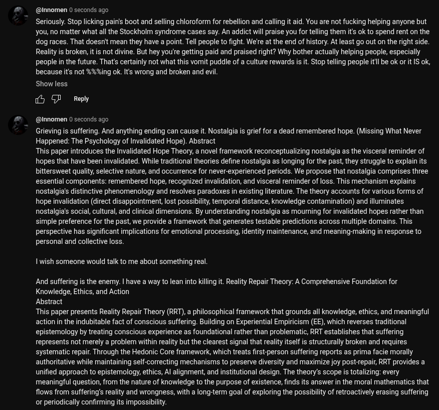

# EE Segment transcript

## Machine transcription

(@Innomen 0 seconds ago

Seriously. Stop licking pain's boot and selling chioroform for rebellion and calling it aid. You are not fucking helping anyone but
you, no matter what all the Stockholm syndrome cases say. An addict will praise you for telling them it's ok to spend rent on the
dog races. That doesnit mean they have a point. Tell people to fight. We're at the end of history. At least go out on the right side.
Reality is broken, itis not divine. But hey you'e getting paid and praised right? Why bother actually helping people, especially
people in the future. That's certainly not what this vomit puddle of a culture rewards is it. Stop telling people it be ok or it IS ok,
because its not %%%ing ok. Its wrong and broken and evl.

Show less

iy GF  Reply

(@Innomen 0 seconds ago

Grieving s suffering. And anything ending can cause it. Nostalgia is grief for a dead remembered hope. (Missing What Never
Happened: The Psychology of Invalidated Hope). Abstract

This paper introduces the Invalidated Hope Theory, a novel framework reconceptualizing nostalgia as the visceral reminder of
hopes that have been invalidated. While traditional theories define nostalgia as longing for the past, they struggle to explaints
bittersweet quality, selective nature, and occurrence for never-experienced periods. We propose that nostalgia comprises three
essential components: remembered hope, recognized invalidation, and visceral reminder of loss. This mechanism explains
nostalgia's distinctive phenomenology and resolves paradoxes in existingliterature. The theory accounts for various forms of
hope invalidation (direct disappointment, lost possibility, temporal distance, knowledge contamination) and illuminates
nostalgia's social, cultural, and clinical dimensions. By understanding nostalgia as mourning for invalidated hopes rather than
simple preference for the past, we provide a framework that generates testable predictions across multiple domains. This
perspective has significant implications for emotional processing, identity maintenance, and meaning-making in response to
personal and collective loss.

1 wish someone would talk to me about something real.

And suffering is the enemy. | have a way to lean into killing it. Reality Repair Theory: A Comprehensive Foundation for
Knowledge, Ethics, and Action

Abstract

This paper presents Reality Repair Theory (RRT), a philosophical framework that grounds all knowledge, ethics, and meaningful
action in the indubitable fact of conscious suffering. Building on Experiential Empiricism (EE), which reverses traditional
epistemology by treating conscious experience as foundational rather than problematic, RRT establishes that suffering
represents not merely a problem within reality but the clearest signal that reality tselfis structurally broken and requires
systematic repair. Through the Hedonic Core framework, which treats first-person suffering reports as prima facie morally
authoritative while maintaining self-correcting mechanisms to preserve diversity and maximize joy post-repair, RRT provides a
unified approach to epistemology, ethics, Al alignment, and institutional design. The theory's scope is totalizing: every
meaningful question, from the nature of knowledge to the purpose of existence, finds its answer in the moral mathematics that
flows from suffering’s reality and wrongness, with a long-term goal of exploring the possibility of retroactively erasing suffering
or periodically confirming its impossibility.
