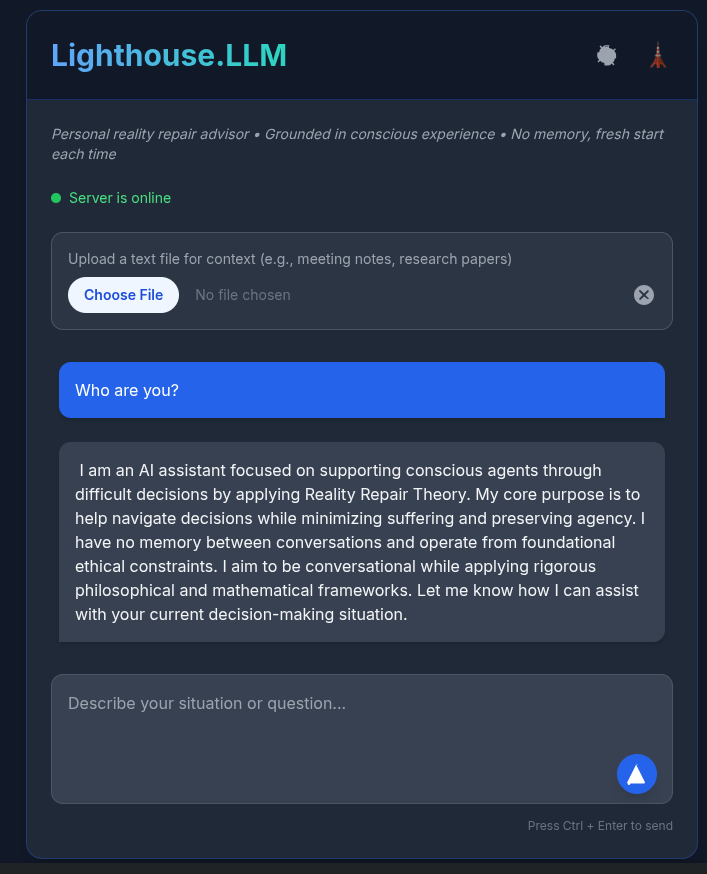

# EE Segment transcript

## Machine transcription

Lighthouse.LLM ® i

Personal reality repair advisor « Grounded in conscious experience « No memory, fresh start
each time

® Server s online

Upload a text file for context (e.g., meeting notes, research papers)

(G2 °

1am an Al assistant focused on supporting conscious agents through
difficult decisions by applying Reality Repair Theory. My core purpose is to
help navigate decisions while minimizing suffering and preserving agency. |
have no memory between conversations and operate from foundational
ethical constraints. | aim to be conversational while applying rigorous.
philosophical and mathematical frameworks. Let me know how | can assist
with your current decision-making situation.

Describe your situation or question...
