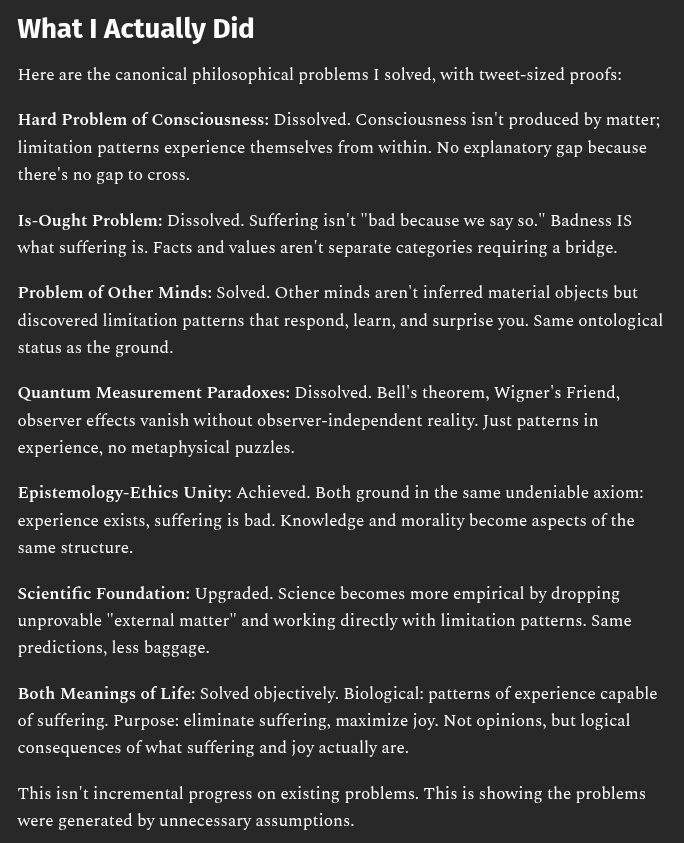

# EE Segment transcript

## Machine transcription

What | Actually Did

Here are the canonical philosophical problems I solved, with tweet-sized proofs:

Hard Problem of Consciousness: Dissolved. Consciousness isn't produced by matter;
limitation patterns experience themselves from within. No explanatory gap because

there's no gap to cross.

Is-Ought Problem: Dissolved. Suffering isn't "bad because we say so." Badness IS

what suffering is. Facts and values aren't separate categories requiring a bridge.

Problem of Other Minds: Solved. Other minds aren't inferred material objects but
discovered limitation patterns that respond, learn, and surprise you. Same ontological

status as the ground.

Quantum Measurement Paradoxes: Dissolved. Bell's theorem, Wigner's Friend,
observer effects vanish without observer-independent reality. Just patterns in

experience, no metaphysical puzzles.

Epistemology-Ethics Unity: Achieved. Both ground in the same undeniable axiom:
experience exists, suffering is bad. Knowledge and morality become aspects of the

same structure.

Scientific Foundation: Upgraded. Science becomes more empirical by dropping
unprovable "external matter” and working directly with limitation patterns. Same

predictions, less baggage.

Both Meanings of Life: Solved objectively. Biological: patterns of experience capable
of suffering. Purpose: eliminate suffering, maximize joy. Not opinions, but logical

consequences of what suffering and joy actually are.

This isn't incremental progress on existing problems. This is showing the problems

‘were generated by unnecessary assumptions.
