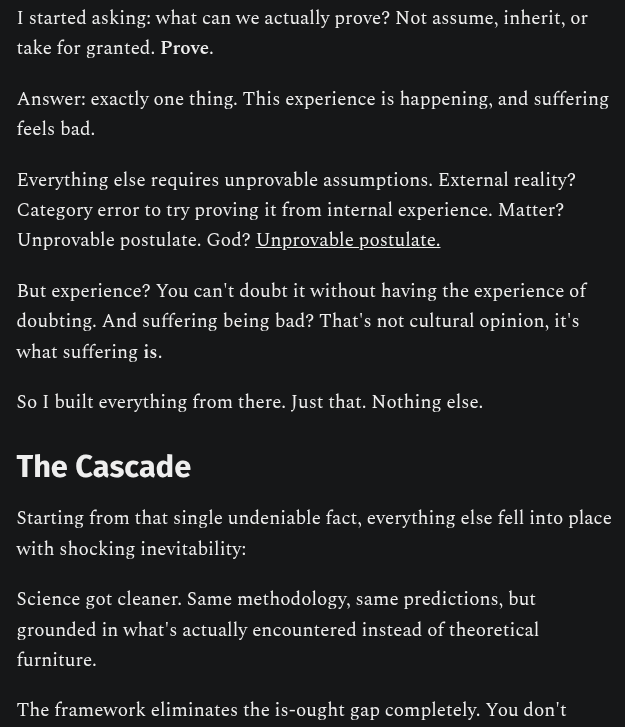

# EE Segment transcript

## Machine transcription

I started asking: what can we actually prove? Not assume, inherit, or

take for granted. Prove.

Answer: exactly one thing. This experience is happening, and suffering
feels bad.

Everything else requires unprovable assumptions. External reality?
Category error to try proving it from internal experience. Matter?
Unprovable postulate. God? Unprovable postulate.

But experience? You can't doubt it without having the experience of
doubting. And suffering being bad? That's not cultural opinion, it's

what suffering is.

So I built everything from there. Just that. Nothing else.

The Cascade

Starting from that single undeniable fact, everything else fell into place
with shocking inevitability:

Science got cleaner. Same methodology, same predictions, but
grounded in what's actually encountered instead of theoretical

furniture.

The framework eliminates the is-ought gap completely. You don't
