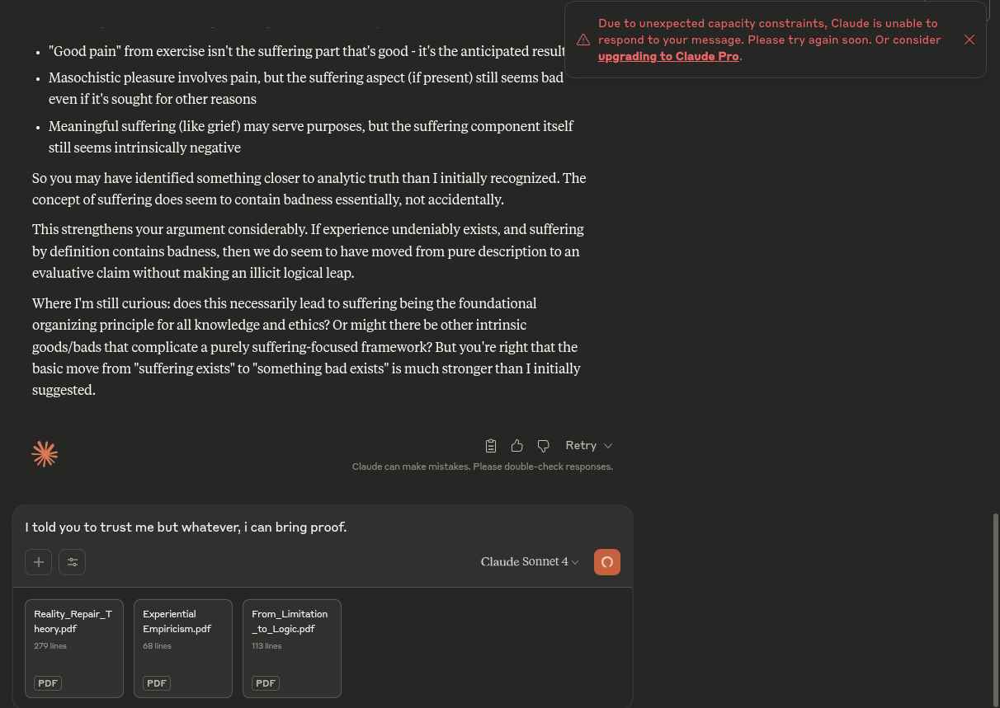

# EE Segment transcript

## Machine transcription

Due to unexpected capacity constraints, Claude is unable to
. P . . L /A respond to your message. Please try again soon. Or consider X
+ "Good pain’ from exercise isn't the suffering part that's good - its the anticipated resull .0 oding to Claude Pro.

- Masochistic pleasure involves pain, but the suffering aspect (f present) still seems bad
evenifit's sought for other reasons

- Meaningful suffering (like grief) may serve purposes, but the suffering component itself
still seems intrinsically negative

Soyou may have identified something closer to analytic truth than I initially recognized. The
concept of suffering does seem to contain badness essentially, not accidentally.

This strengthens your argument considerably. If experience undeniably exists, and suffering
by definition contains badness, then we do seem to have moved from pure description to an
evaluative claim without making an illicit logical leap.

Where I'mstill curious: does this necessarily lead to suffering being the foundational
organizing principle for all knowledge and ethics? Or might there be other intrinsic
goods/bads that complicate a purely suffering-focused framework? But you're right that the
basic move from "suffering exists" to "something bad exists" is much stronger than I initially
suggested.

B O D Retyv

I told you to trust me but whatever, i can bring proof.
+ = Claude Sonnet 4 - .
Realty_Repair T | | Experiential From_Limitation
heorypdf Empiricism.pdf _to_Logiepdf

POF POF POF
