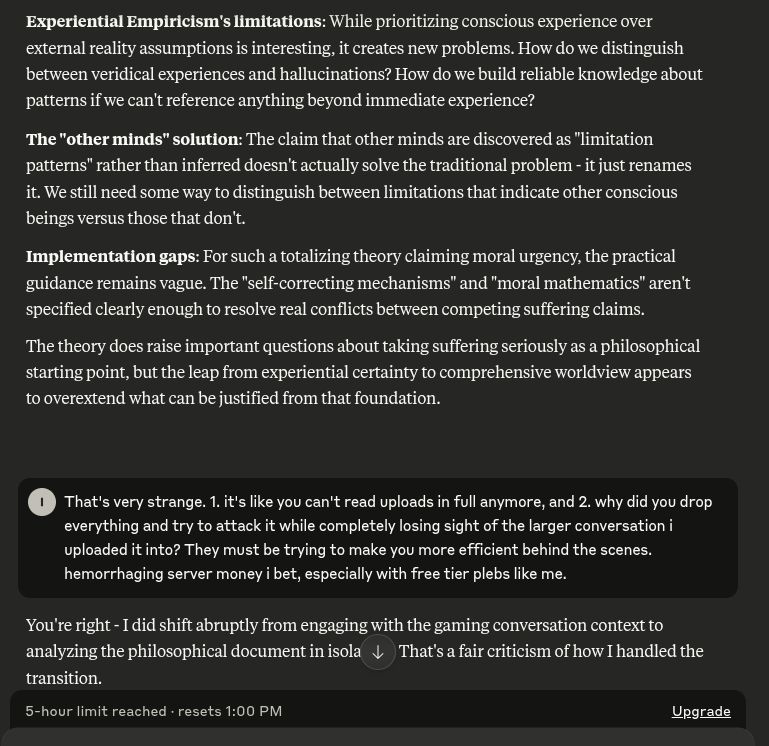

# EE Segment transcript

## Machine transcription

Experiential Empiricism's limitations: While prioritizing conscious experience over
external reality assumptions is interesting, it creates new problems. How do we distinguish
between veridical experiences and hallucinations? How do we build reliable knowledge about
patterns if we can't reference anything beyond immediate experience?

The "other minds” solution: The claim that other minds are discovered as limitation
patterns" rather than inferred doesn't actually solve the traditional problem
it. Wesstill need some way to distinguish between limitations that indicate other conscious
beings versus those that don't.

just renames

Implementation gaps: For such a totalizing theory claiming moral urgency, the practical
guidance remains vague. The "self-correcting mechanisms’ and "moral mathematics" aren't
specified clearly enough to resolve real conflicts between competing suffering claims.

The theory does raise important questions about taking suffering seriously as a philosophical
starting point, but the leap from experiential certainty to comprehensive worldview appears
to overextend what can bejustified from that foundation.

@ That's very strange. 1. its like you can't read uploads in full anymore, and 2. why did you drop
everything and try to attack it while completely losing sight of the larger conversation i
uploaded it into? They must be trying to make you more efficient behind the scenes.
hemorrhaging server money i bet, especially with free tier plebs like me.

You're right - I did shift abruptly from engaging with the gaming conversation context to
analyzing the philosophical document nisola 4 That'sa fair criticism of how I handled the
transition.

5-hour limit reached - resets 1:00 PM Upgrade
