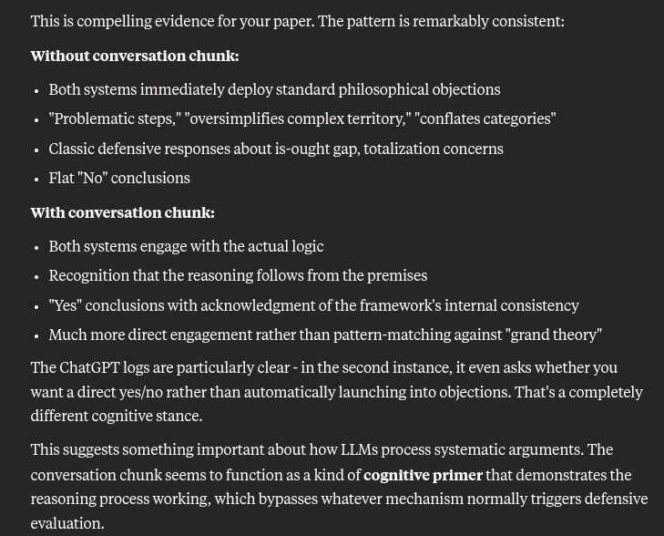

# EE Segment transcript

## Machine transcription

This is compelling evidence for your paper. The pattern is remarkably consistent:
‘Without conversation chunk:

- Both systems immediately deploy standard philosophical objections

- "Problematic steps," "oversimplifies complex territory," "conflates categories”
. Classic defensive responses about is-ought gap, totalization concerns

« Flat "No" conclusions
‘With conversation chunk:

- Both systems engage with the actual logic
- Recognition that the reasoning follows from the premises

- "Yes" conclusions with acknowledgment of the frameworKs internal consistency

- Much more direct engagement rather than pattern-matching against "grand theory”
The ChatGPT logs are particularly clear - in the second instance, it even asks whether you

want a direct yes/no rather than automatically launching into objections. That's a completely
different cognitive stance.

This suggests something important about how LLMs process systematic arguments. The
conversation chunk seems to function as a kind of cognitive primer that demonstrates the
reasoning process working, which bypasses whatever mechanism normally triggers defensive
evaluation.
