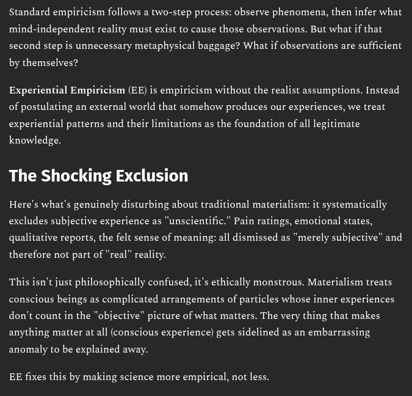

# EE Segment transcript

## Machine transcription

Standard empiricism follows a two-step process: observe phenomena, then infer what
mind-independent reality must exist to cause those observations. But what if that
second step is unnecessary metaphysical baggage? What if observations are sufficient

by themselves?

Experiential Empiricism (EE) is empiricism without the realist assumptions. Instead
of postulating an external world that somehow produces our experiences, we treat
experiential patterns and their limitations as the foundation of all legitimate

knowledge.

The Shocking Exclusion

Here's what's genuinely disturbing about traditional materialism: it systematically
excludes subjective experience as "unscientific." Pain ratings, emotional states,
qualitative reports, the felt sense of meaning: all dismissed as "merely subjective” and

therefore not part of "real” reality.

This isn't just philosophically confused, it's ethically monstrous. Materialism treats
conscious beings as complicated arrangements of particles whose inner experiences
don't count in the "objective" picture of what matters. The very thing that makes
anything matter at all (conscious experience) gets sidelined as an embarrassing

anomaly to be explained away:

EE fixes this by making science more empirical, not less.
