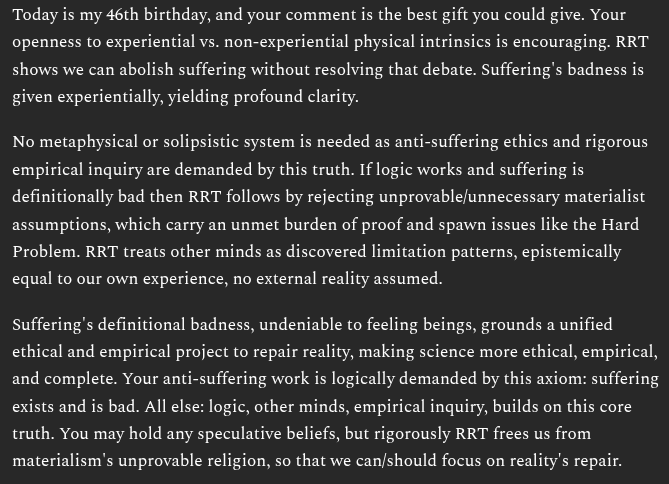

# EE Segment transcript

## Machine transcription

Today is my 46th birthday, and your comment s the best gift you could give. Your
openness to experiential vs. non-experiential physical intrinsics is encouraging. RRT
shows we can abolish suffering without resolving that debate. Suffering's badness is

given experientially, yielding profound clarity.

No metaphysical or solipsistic system is needed as anti-suffering ethics and rigorous
empirical inquiry are demanded by this truth. If logic works and suffering is
definitionally bad then RRT follows by rejecting unprovable/unnecessary materialist
assumptions, which carry an unmet burden of proof and spawn issues like the Hard
Problem. RRT treats other minds as discovered limitation patterns, epistemically

equal to our own experience, no external reality assumed.

Suffering’s definitional badness, undeniable to feeling beings, grounds a unified

ethical and empirical project to repair reality, making science more ethical, empirical,
and complete. Your anti-suffering work is logically demanded by this axiom: suffering
exists and is bad. All else: logic, other minds, empirical inquiry, builds on this core
truth. You may hold any speculative beliefs, but rigorously RRT frees us from

materialism's unprovable religion, so that we can/should focus on reality's repair.
