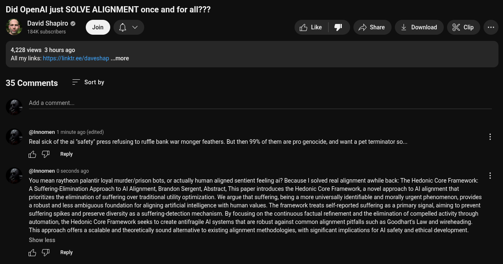

# EE Segment transcript

## Machine transcription

Did OpenAl just SOLVE ALIGNMENT once and for all???
§l David Shapiro & @ o v 5 Like & > shae L Download ¢ Clip -

184K subscribers

4,228 views 3 hours ago
Al my links: https:/inklr.ee/daveshap

ore

35Comments = Sortby

#  Add a comment.

@ @nnomen 1 minute ago (edited) .
Real sick of the ai "safety” press refusing to ruffle bank war monger feathers. But then 99% of them are pro genocide, and want a pet terminator so..

iy GF  Reply

#  @Innomen 0 seconds ago
You mean raytheon palantir loyal murder/prison bots, or actually human aligned sentient feeling i? Because | solved real alignment awhile back: The Hedonic Core Framework
A Suffering-Elimination Approach to Al Alignment, Brandon Sergent, Abstract, This paper introduces the Hedonic Core Framework, a novel approach to Al alignment that
prioritizes the elimination of suffering over traditional utilty optimization. We argue that suffering, being a more universally identifiable and morally urgent phenomenon, provides
a robust and less ambiguous foundation for aligning artificial intelligence with human values. The framework treats self-reported suffering as a primary signal, aiming to prevent
suffering spikes and preserve diversity as a suffering-detection mechanism. By focusing on the continuous factual refinement and the elimination of compelled activity through
automation, the Hedonic Core Framework seeks to create antifragile Al systems that are robust against common alignment pitfalls such as Goodhart's Law and wireheading
This approach offers a scalable and theoretically sound altemative to existing alignment methodologies, with significant implications for Al safety and ethical development.

Show less

iy GF  Reply
