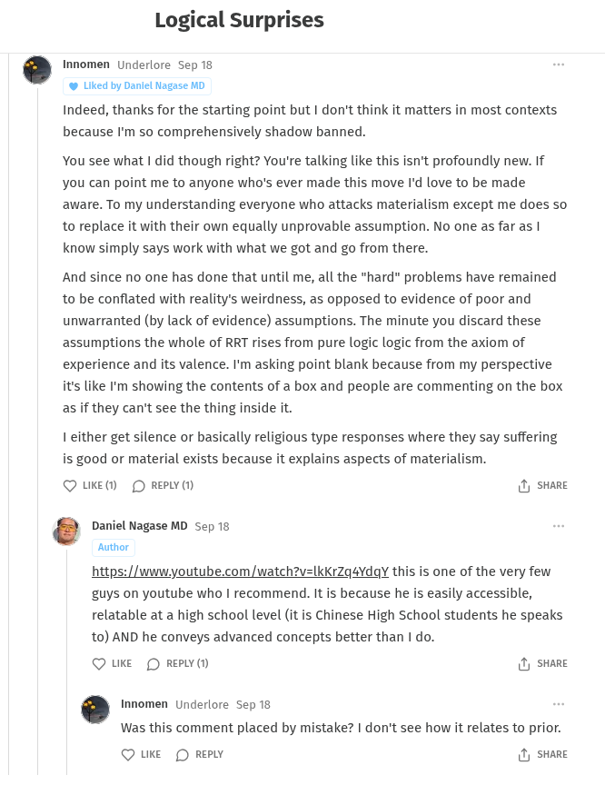

# EE Segment transcript

## Machine transcription

Logical Surprises

. Innomen Underlore Sep 18

@ Liked by Daniel Nagase MD
Indeed, thanks for the starting point but | don't think it matters in most contexts
because 'm so comprehensively shadow banned.

You see what | did though right? You're talking like this isn't profoundly new. If
you can point me to anyone who's ever made this move I'd love to be made
aware. To my understanding everyone who attacks materialism except me does so
to replace it with their own equally unprovable assumption. No one as far as |
know simply says work with what we got and go from there.

And since no one has done that until me, all the "hard" problems have remained
to be conflated with reality's weirdness, as opposed to evidence of poor and
unwarranted (by lack of evidence) assumptions. The minute you discard these
assumptions the whole of RRT rises from pure logic logic from the axiom of
experience and its valence. I'm asking point blank because from my perspective
it's like 'm showing the contents of a box and people are commenting on the box
as if they can't see the thing inside it.

1 either get silence or basically religious type responses where they say suffering
is good or material exists because it explains aspects of materialism.

Q UKE®M D REPLY (1) & sHare

’ Daniel Nagase MD Sep 18

Author

https://www.youtube.com /watch?v=IkKrZq4YdaY this is one of the very few
guys on youtube who | recommend. It is because he is easily accessible,
relatable at a high school level (it is Chinese High School students he speaks
t0) AND he conveys advanced concepts better than I do.

Q uKke O RepY () & sHare

. Innomen Underlore Sep 18

Was this comment placed by mistake? | don't see how it relates to prior.

Q uke [ Repwy & sHare
