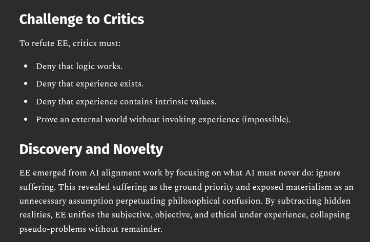

# EE Segment transcript

## Machine transcription

Challenge to Critics

To refute EE, critics must:

* Deny that logic works.
* Deny that experience exists.
« Deny that experience contains intrinsic values.

« Prove an external world without invoking experience (impossible).

Discovery and Novelty

EE emerged from Al alignment work by focusing on what AT must never do: ignore
suffering. This revealed suffering as the ground priority and exposed materialism as an
unnecessary assumption perpetuating philosophical confusion. By subtracting hidden
realities, EE unifies the subjective, objective, and ethical under experience, collapsing

pseudo-problems without remainder.
