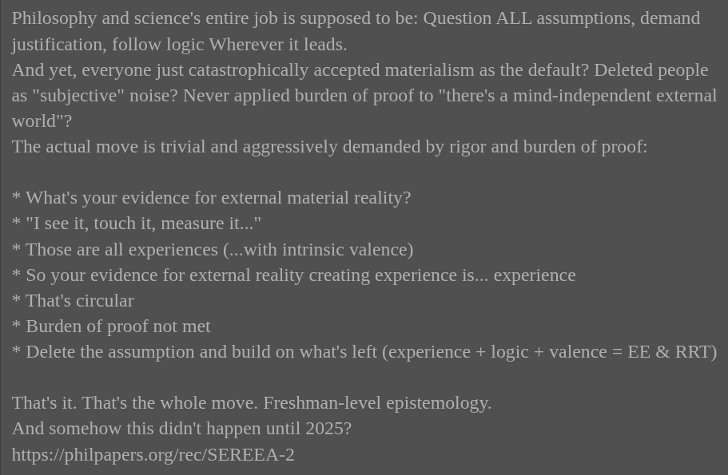

# EE Segment transcript

## Machine transcription

Philosophy and science's entire job is supposed to be: Question ALL assumptions, demand
justification, follow logic Wherever it leads.

And yet, everyone just catastrophically accepted materialism as the default? Deleted people
as "subjective" noise? Never applied burden of proof to "there's a mind-independent external
world"?

The actual move is trivial and aggressively demanded by rigor and burden of proof:

* What's your evidence for external material reality?

* '"[ see it, touch it, measure it..."

* Those are all experiences (...with intrinsic valence)

* So your evidence for external reality creating experience is... experience

* That's circular

* Burden of proof not met

* Delete the assumption and build on what's left (experience + logic + valence = EE & RRT)

That's it. That's the whole move. Freshman-level epistemology.
And somehow this didn't happen until 2025?
https://philpapers.org/rec/SEREEA-2
