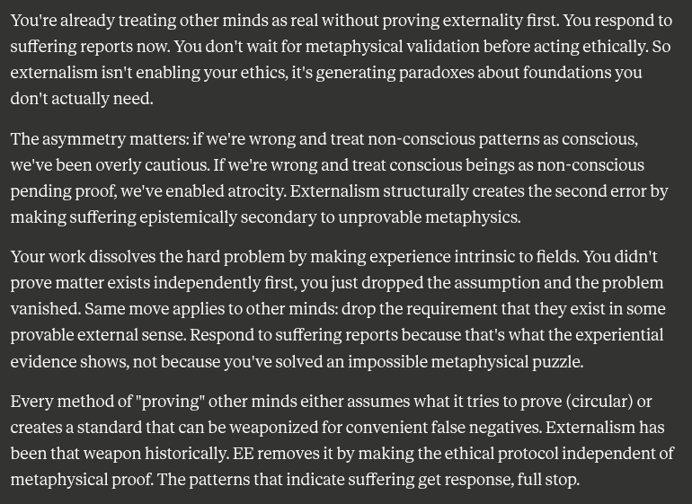

# EE Segment transcript

## Machine transcription

You're already treating other minds as real without proving externality first. You respond to
suffering reports now. You don't wait for metaphysical validation before acting ethically. So
externalism isn't enabling your ethics, it's generating paradoxes about foundations you
don'tactually need.

The asymmetry matters: if we're wrong and treat non-conscious patterns as conscious,
we've been overly cautious. If we're wrong and treat conscious beings as non-conscious
pending proof, we've enabled atrocity. Externalism structurally creates the second error by
making suffering epistemically secondary to unprovable metaphysics.

Your work dissolves the hard problem by making experience intrinsic to fields. You didn't
prove matter exists independently first, you just dropped the assumption and the problem
vanished. Same move applies to other minds: drop the requirement that they exist in some
provable external sense. Respond to suffering reports because that's what the experiential
evidence shows, not because you've solved an impossible metaphysical puzzle.

Every method of "proving" other minds either assumes what it tries to prove (circular) or
creates a standard that can be weaponized for convenient false negatives. Externalism has
been that weapon historically. EE removes it by making the ethical protocol independent of
metaphysical proof. The patterns that indicate suffering get response, full stop.
