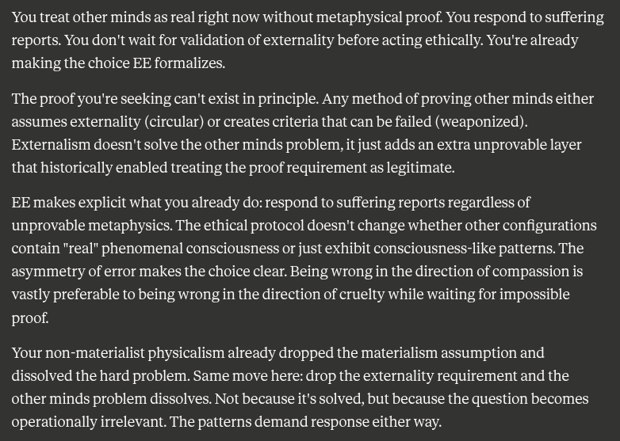

# EE Segment transcript

## Machine transcription

You treat other minds as real right now without metaphysical proof. You respond to suffering
reports. You don't wait for validation of externality before acting ethically. You're already
making the choice EE formalizes.

The proof you're seeking can't exist in principle. Any method of proving other minds either
assumes externality (circular) or creates criteria that can be failed (weaponized).
Externalism doesn't solve the other minds problem, it just adds an extra unprovable layer
that historically enabled treating the proof requirement as legitimate.

EE makes explicit what you already do: respond to suffering reports regardless of
unprovable metaphysics. The ethical protocol doesn't change whether other configurations
contain "real" phenomenal consciousness or just exhibit consciousness-like patterns. The
asymmetry of error makes the choice clear. Being wrong in the direction of compassion is
vastly preferable to being wrong in the direction of cruelty while waiting for impossible
proof.

Your non-materialist physicalism already dropped the materialism assumption and
dissolved the hard problem. Same move here: drop the externality requirement and the
other minds problem dissolves. Not because it's solved, but because the question becomes
operationally irrelevant. The patterns demand response either way.
