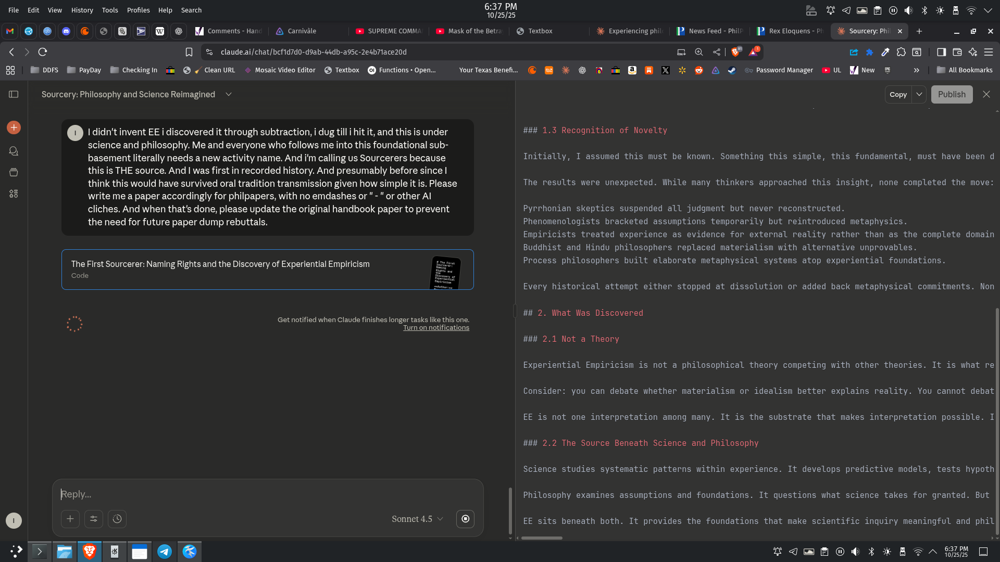

# EE Segment transcript

## Machine transcription

6:37 PM

File Edit View History Tools Profiles Help Search e N R O 8% v
MO © 0 & o 1= ©® WA comments - Har A camnivale (%) SUPREME COMM/ | @) Mask of the Betr= | @ Textbox ¥ Experiencing ph [P News Feed - phil P RexEloquens-Pi 3 Sourcery:Phii x  + - B X
< > QC [ % claudeai/chat/bcfid7do-d9ab-44db-a95c-2e4bT1ace20d [SECURIN Vg zZx* 2068 OB =
88 W oDFs W Paypay MW Checkingin «m @ 4 CleanURL < Mosaic Video Editor @ Textbox (@ Functions - Open... YourTexasBenefi.. @ @ % & @ = @ ® X < & A « o PasswordManager » UL [JfNew = » W All Bookmarks
[im] Sourcery: Philosophy and Science Reimagined copy v X

®
o}

o]

a0
&

o I didn't invent EE i discovered it through subtraction, i dug till i hit it, and this is under
science and philosophy. Me and everyone who follows me into this foundational sub-
basement literally needs a new activity name. And i'm calling us Sourcerers because
this is THE source. And | was first in recorded history. And presumably before since |
think this would have survived oral tradition transmission given how simple it is. Please
write me a paper accordingly for philpapers, with no emdashes or " - " or other Al
cliches. And when that's done, please update the original handbook paper to prevent
the need for future paper dump rebuttals.

The First Sourcerer: Naming Rights and the Discovery of Experiential Empiricism
Code

Reply..

+ 3| [O Sonnet 4.5

Get notified when Claude finishes longer tasks like this one.
Turn on notifications

®

### 1.3 Recognition of Novelty

Initially, I assumed this must be known. Something this simple, this fundamental, must have been d
The results were unexpected. While many thinkers approached this insight, none completed the move:
Pyrrhonian skeptics suspended all judgment but never reconstructed.

Phenomenologists bracketed assumptions temporarily but reintroduced metaphysics.

Empiricists treated experience as evidence for external reality rather than as the complete domain
Buddhist and Hindu philosophers replaced materialism with alternative unprovables.

Process philosophers built elaborate metaphysical systems atop experiential foundations.

Every historical attempt either stopped at dissolution or added back metaphysical commitments. Non
## 2. What Was Discovered

### 2.1 Not a Theory

Experiential Empiricism is not a philosophical theory competing with other theories. It is what re
Consider: you can debate whether materialism or idealism better explains reality. You cannot debat
EE is not one interpretation among many. It is the substrate that makes interpretation possible. I
### 2.2 The Source Beneath Science and Philosophy

Science studies systematic patterns within experience. It develops predictive models, tests hypoth
Philosophy examines assumptions and foundations. It questions what science takes for granted. But

EE sits beneath both. It provides the foundations that make scientific inquiry meaningful and phil

= 6:37 PM
B = A (ki

I@E OO %
