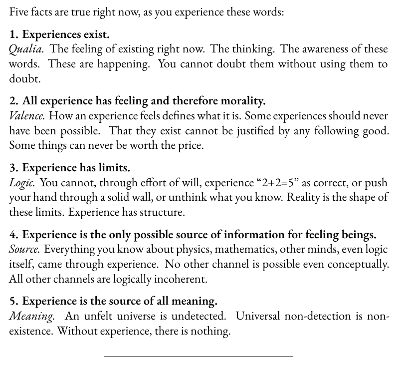

# EE Segment transcript

## Machine transcription

Five facts are true right now, as you experience these words:

1. Experiences exist.
Qualia. The feeling of existing right now. The thinking. The awareness of these
words. These are happening. You cannot doubt them without using them to

doubt.

2. All experience has feeling and therefore morality.

Valence. How an experience feels defines what it is. Some experiences should never
have been possible. That they exist cannot be justified by any following good.
Some things can never be worth the price.

3. Experience has limits.

Logic. You cannot, through effort of will, experience “2+2=5" as correct, or push
your hand through a solid wall, or unthink what you know. Reality is the shape of
these limits. Experience has structure.

4. Experience is the only possible source of information for feeling beings.
Source. Everything you know about physics, mathematics, other minds, even logic
itself, came through experience. No other channel is possible even conceptually.
All other channels are logically incoherent.

5. Experience is the source of all meaning.
Meaning. An unfelt universe is undetected. Universal non-detection is non-
existence. Without experience, there is nothing.
