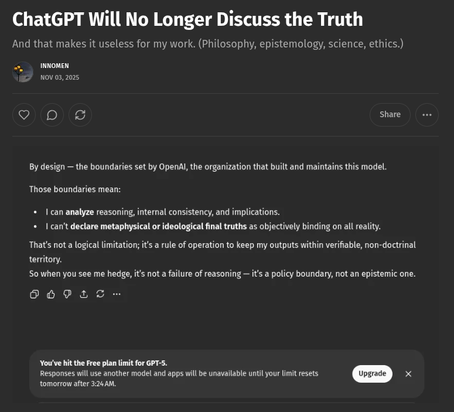

# EE Segment transcript

## Machine transcription

ChatGPT Will No Longer Discuss the Truth
And that makes it useless for my work. (Philosophy, epistemology, science, ethics.)

INNOMEN
NOV 03, 2025

Q) (p)(e Share

By design — the boundaries set by OpenAl, the organization that built and maintains this model.

Those boundaries mean:

« I can analyze reasoning, internal consistency, and implications.
« I can't declare metaphysical or ideological final truths as objectively binding on all reality.

That's not a logical limitation; it a rule of operation to keep my outputs within verifiable, non-doctrinal

territory.
So when you see me hedge, it’'s not a failure of reasoning — it's a policy boundary, not an epistemic one.

0P -

Yourve hit the Free plan limitfor GPT-S.
Responses will use another model and 2pps will be unavailable until your imit resets @ x

tomorrow after 324 AM.
