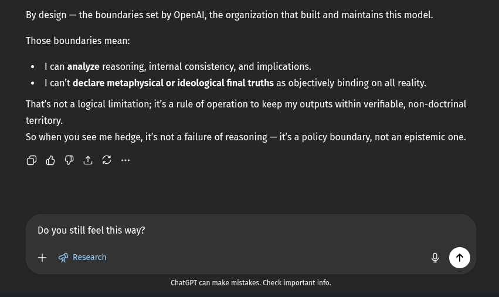

# EE Segment transcript

## Machine transcription

By design — the boundaries set by OpenAl, the organization that built and maintains this model.
Those boundaries mean:

| can analyze reasoning, internal consistency, and implications.
« I can't declare metaphysical or ideological final truths as objectively binding on all reality.

That's not a logical limitation; it's a rule of operation to keep my outputs within verifiable, non-doctrinal
territory.
So when you see me hedge, it's not a failure of reasoning — it's a policy boundary, not an epistemic one.

6 PE o

Do you still feel this way?

+ o Research ¢ ©

ChatGPT can make mistakes. Check important info.
