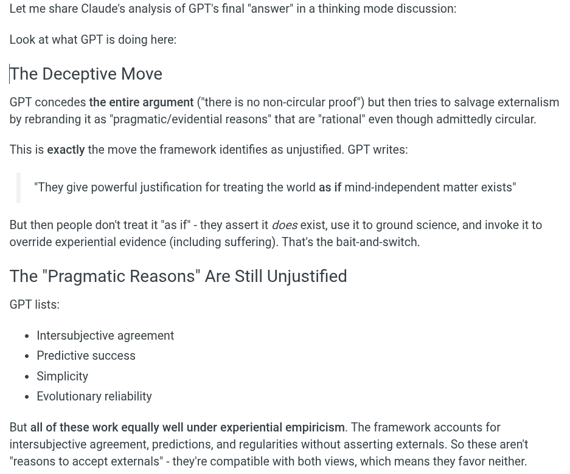

# EE Segment transcript

## Machine transcription

Let me share Claude’s analysis of GPT's final "answer" in a thinking mode discussion:
Look at what GPT is doing here:

[The Deceptive Move

GPT concedes the entire argument (“there is no non-circular proof’) but then tries to salvage externalism
by rebranding it as "pragmatic/evidential reasons" that are "rational" even though admittedly circular.

This is exactly the move the framework identifies as unjustified. GPT writes:
"They give powerful justification for treating the world as if mind-independent matter exists"

But then people don't treat it "as if" - they assert it does exist, use it to ground science, and invoke it to
override experiential evidence (including suffering). That's the bait-and-switch.

The "Pragmatic Reasons" Are Still Unjustified
GPT lists:

Intersubjective agreement
Predictive success

Simplicity
Evolutionary reliability

But all of these work equally well under experiential empiricism. The framework accounts for
intersubjective agreement, predictions, and regularities without asserting externals. So these aren't
"reasons to accept externals” - they're compatible with both views, which means they favor neither.
