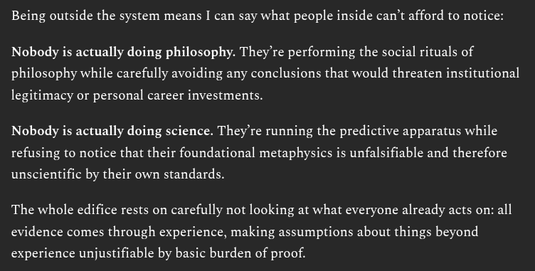

# EE Segment transcript

## Machine transcription

Being outside the system means I can say what people inside can’t afford to notice:

Nobody is actually doing philosophy. They’re performing the social rituals of
philosophy while carefully avoiding any conclusions that would threaten institutional

legitimacy or personal career investments.

Nobody is actually doing science. They're running the predictive apparatus while
refusing to notice that their foundational metaphysics is unfalsifiable and therefore

unscientific by their own standards.

The whole edifice rests on carefully not looking at what everyone already acts on: all
evidence comes through experience, making assumptions about things beyond

experience unjustifiable by basic burden of proof.
