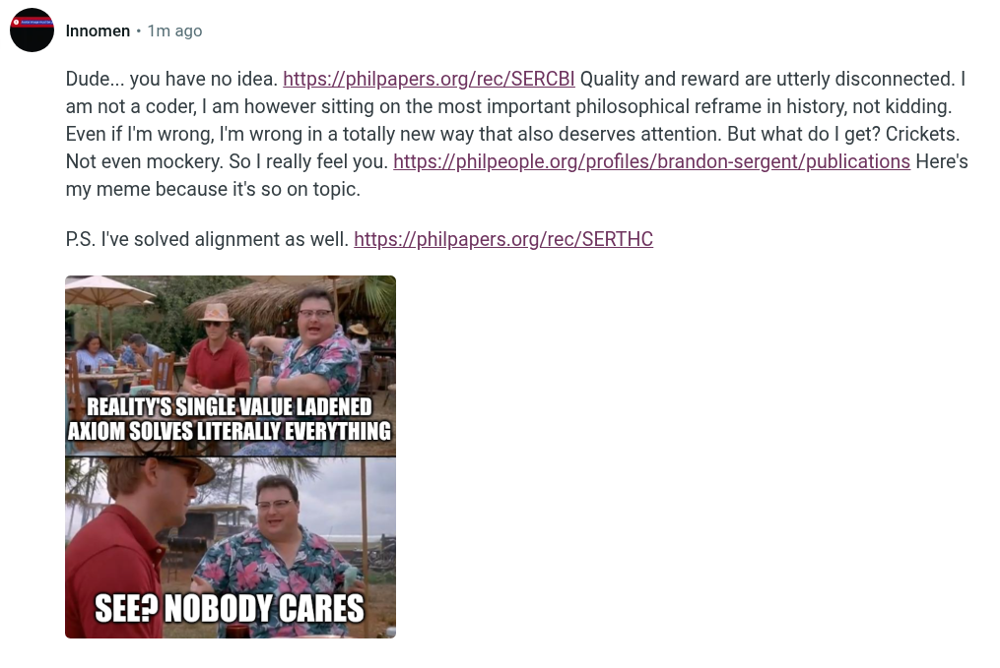

# EE Segment transcript

## Machine transcription

Dude... you have no idea. https:/philpapers.org/rec/SERCBI Quality and reward are utterly disconnected. |
am not a coder, | am however sitting on the most important philosophical reframe in history, not kidding.
Even if 'm wrong, I'm wrong in a totally new way that also deserves attention. But what do | get? Crickets.

Not even mockery. So | really feel you. https:/philpeople.org/profiles/brandon-sergent/publications Here's
my meme because it's so on topic.

PS. I've solved alignment as well. https:/philpapers.org/rec/SERTHC

REALITY;S SINGLEVALUE LADENED
AXIOM SOLVES LITERALLY EVERYTHING

SEED NOBODY CARES
