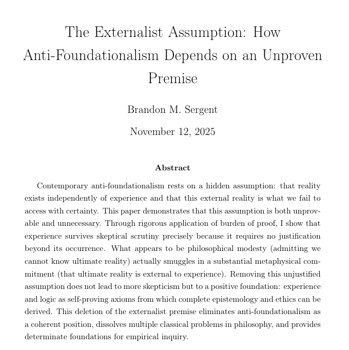

# EE Segment transcript

## Machine transcription

The Externalist Assumption: How
Anti-Foundationalism Depends on an Unproven

Premise

Brandon M. Sergent

November 12, 2025

Abstract

Contemporary anti-foundationalism rests on a hidden assumption: that reality
exists

independently of experience and that this external reality is what we fail to

access with certainty. This paper demonstrates that this

assumption is both unprov-
able and unnec

. Through rigorous application of burden of proof, I show that

experience survives skeptical scrutiny pre

isely because it requires no justification

beyond its occurrence. What appears to be philosophical modesty (admitting we

cannot know ultimate reality) actually smuggles in a substantial metaphy

ified

m but to a positive foundation: experience

mitment (that ultimate reality is external to experience). Removing this unjus

assumption does not lead to more skept

and logic as self-proving axioms from which complete epistemology and ethics can be

derived. This deletion of the externalist premise eliminates anti-foundationalism as

a coherent position, dissolves multiple clas

al problems in philosophy, and provid

determinate foundations for empirical inquiry.
