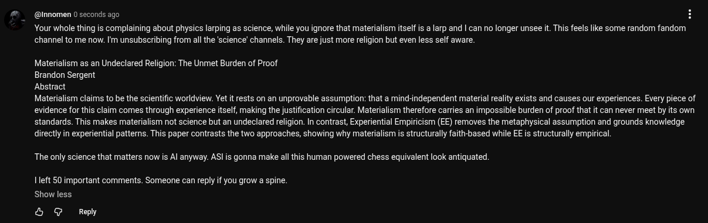

# EE Segment transcript

## Machine transcription

@nnomen 0 seconds ago H

Your whole thing is complaining about physics larping as science, while you ignore that materialism itself is a larp and | can no longer unsee it. This feels like some random fandom
channel to me now. I'm unsubscribing from all the 'science' channels. They are just more religion but even less self aware.

Materialism as an Undeclared Religion: The Unmet Burden of Proof

Brandon Sergent

Abstract

Materialism claims to be the scientific worldview. Vet i rests on an unprovable assumption: that a mind-independent material reality exists and causes our experiences. Every piece of
evidence for this claim comes through experience itself, making the justification circular. Materialism therefore carries an impossible burden of proof that it can never meet by its own
standards. This makes materialism not science but an undeclared religion. In contrast, Experiential Empiricism (EE) removes the metaphysical assumption and grounds knowledge
directly in experiential patterns. This paper contrasts the two approaches, showing why materialism is structurally faith-based while EE is structurally empirical,

The only science that matters now is Al anyway. AS! is gonna make all this human powered chess equivalent look antiquated

1left 50 important comments. Someone can reply f you grow a spine.
Show less

& @ Reply
