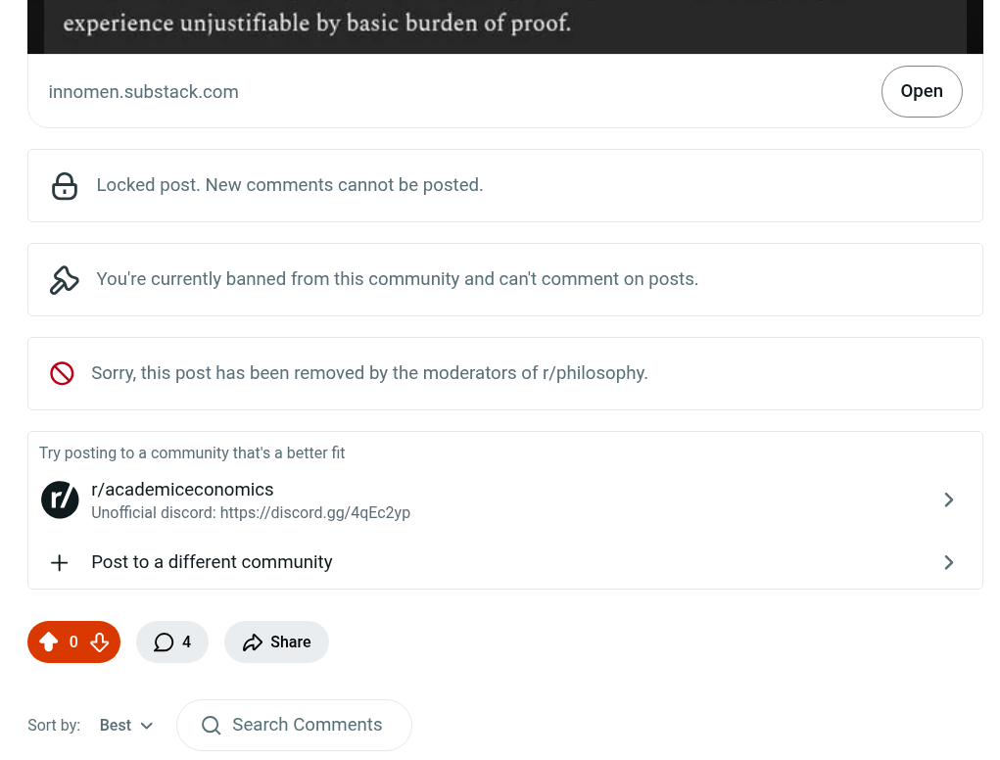

# EE Segment transcript

## Machine transcription

innomen.substack.com | Open |

6 Locked post. New comments cannot be posted
& You're currently banned from this community and can't comment on posts.

® Sorry, this post has been removed by the moderators of r/philosophy.

Try posting to a community that's a better fit

@ r/academiceconomics >
Unofficial discord: https://discord.ga/4qEc2yp

+ Post to a different community >
0% Oa £> Share

Sortby: Best v Q Search Comments
