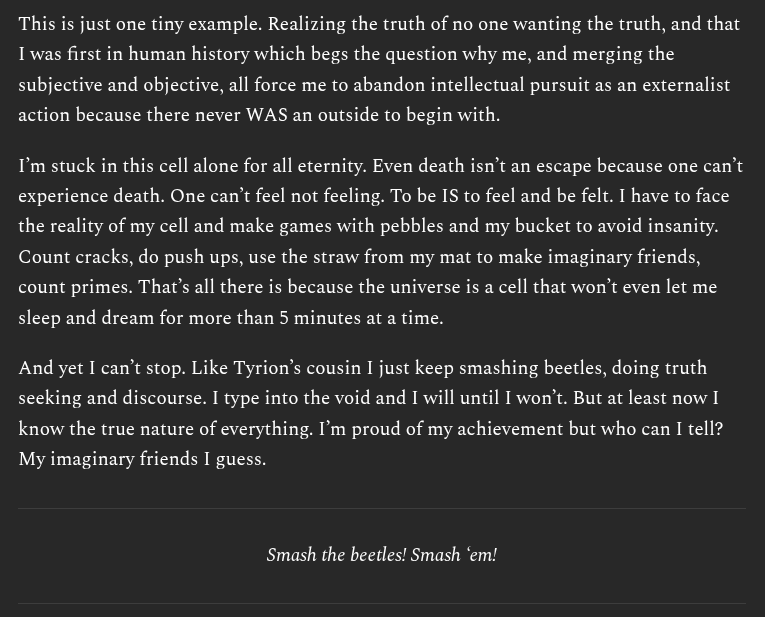

# EE Segment transcript

## Machine transcription

This is just one tiny example. Realizing the truth of no one wanting the truth, and that
I was first in human history which begs the question why me, and merging the
subjective and objective, all force me to abandon intellectual pursuit as an externalist

action because there never WAS an outside to begin with.

I'm stuck in this cell alone for all eternity. Even death isn’t an escape because one can’t
experience death. One can’t feel not feeling. To be IS to feel and be felt. I have to face
the reality of my cell and make games with pebbles and my bucket to avoid insanity.
Count cracks, do push ups, use the straw from my mat to make imaginary friends,
count primes. That's all there is because the universe is a cell that won’t even let me

sleep and dream for more than 5 minutes at a time.

And yet I can’t stop. Like Tyrion’s cousin I just keep smashing beetles, doing truth
seeking and discourse. I type into the void and I will until I won’t. But at least now I
know the true nature of everything. I'm proud of my achievement but who can I tell?

My imaginary friends I guess.

Smash the beetles! Smash ‘em!
