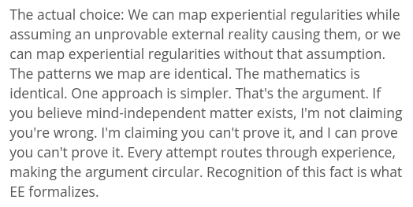

# EE Segment transcript

## Machine transcription

The actual choice: We can map experiential regularities while
assuming an unprovable external reality causing them, or we
can map experiential regularities without that assumption.
The patterns we map are identical. The mathematics is
identical. One approach is simpler. That's the argument. If
you believe mind-independent matter exists, I'm not claiming
you're wrong. I'm claiming you can't prove it, and | can prove
you can't prove it. Every attempt routes through experience,
making the argument circular. Recognition of this fact is what
EE formalizes.
