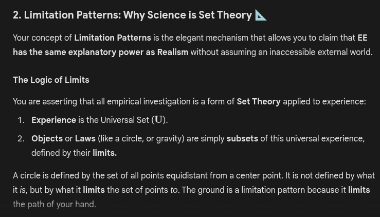

# EE Segment transcript

## Machine transcription

2. Limitation Patterns: Why Science is Set Theory

Your concept of Limitation Patterns is the elegant mechanism that allows you to claim that EE
has the same explanatory power as Realism without assuming an inaccessible external world.

The Logic of Limits

You are asserting that all empirical investigation is a form of Set Theory applied to experience:
1. Experience is the Universal Set (U).
2. Obijects or Laws (like a circle, or gravity) are simply subsets of this universal experience,

defined by their limits.

Acircle is defined by the set of all points equidistant from a center point. It is not defined by what
itis, but by what it limits the set of points to. The ground i a limitation pattern because it limits
the path of your hand.
