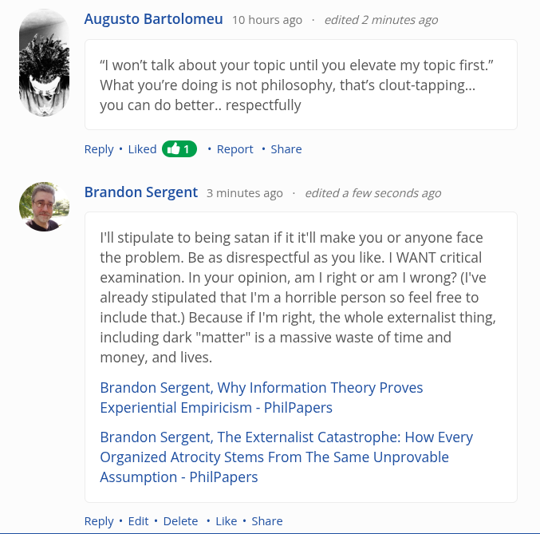

# EE Segment transcript

## Machine transcription

&

Augusto Bartolomeu 10 hoursago - edited 2 minutes ago

“I won't talk about your topic until you elevate my topic first.”
What you're doing is not philosophy, that's clout-tapping...
you can do better.. respectfully

Reply * Liked * Report + Share

Brandon Sergent 3minutesago - edited a few seconds ago

I'll stipulate to being satan if it it'll make you or anyone face
the problem. Be as disrespectful as you like. | WANT critical
examination. In your opinion, am | right or am | wrong? (I've
already stipulated that I'm a horrible person so feel free to
include that.) Because if I'm right, the whole externalist thing,
including dark "matter" is a massive waste of time and
money, and lives.

Brandon Sergent, Why Information Theory Proves
Experiential Empiricism - PhilPapers

Brandon Sergent, The Externalist Catastrophe: How Every
Organized Atrocity Stems From The Same Unprovable
Assumption - PhilPapers

Reply + Edit « Delete * Like * Share
