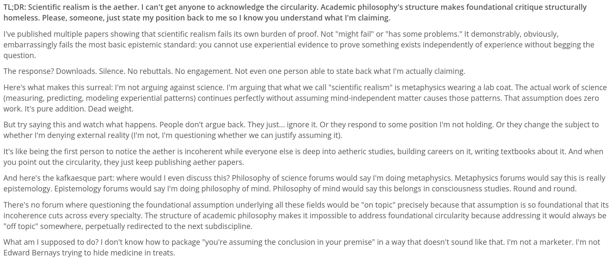

# EE Segment transcript

## Machine transcription

TL;DR: Scientific realism is the aether. | can't get anyone to acknowledge the circularity. Academic philosophy's structure makes foundational critique structurally
homeless. Please, someone, just state my position back to me so | know you understand what I'm claiming.

I've published multiple papers showing that scientific realism fails its own burden of proof. Not "might fail" or "has some problems." It demonstrably, obviously,
embarrassingly fails the most basic epistemic standard: you cannot use experiential evidence to prove something exists independently of experience without begging the
question.

The response? Downloads. Silence. No rebuttals. No engagement. Not even one person able to state back what I'm actually claiming.

Here's what makes this surreal: I'm not arguing against science. I'm arguing that what we call "scientific realism" is metaphysics wearing a lab coat. The actual work of science
(measuring, predicting, modeling experiential patterns) continues perfectly without assuming mind-independent matter causes those patterns. That assumption does zero
work. It's pure addition. Dead weight.

But try saying this and watch what happens. People don't argue back. They just... ignore it. Or they respond to some position I'm not holding. Or they change the subject to
whether I'm denying external reality (I'm not, I'm questioning whether we can justify assuming it).

It's like being the first person to notice the aether is incoherent while everyone else is deep into aetheric studies, building careers on it, writing textbooks about it. And when
you point out the circularity, they just keep publishing aether papers.

And here's the kafkaesque part: where would | even discuss this? Philosophy of science forums would say I'm doing metaphysics. Metaphysics forums would say this is really
epistemology. Epistemology forums would say I'm doing philosophy of mind. Philosophy of mind would say this belongs in consciousness studies. Round and round.

There's no forum where questioning the foundational assumption underlying all these fields would be "on topic" precisely because that assumption is so foundational that its
incoherence cuts across every specialty. The structure of academic philosophy makes it impossible to address foundational circularity because addressing it would always be
"off topic" somewhere, perpetually redirected to the next subdiscipline.

What am | supposed to do? | don't know how to package "you're assuming the conclusion in your premise” in a way that doesn't sound like that. I'm not a marketer. I'm not
Edward Bernays trying to hide medicine in treats.
