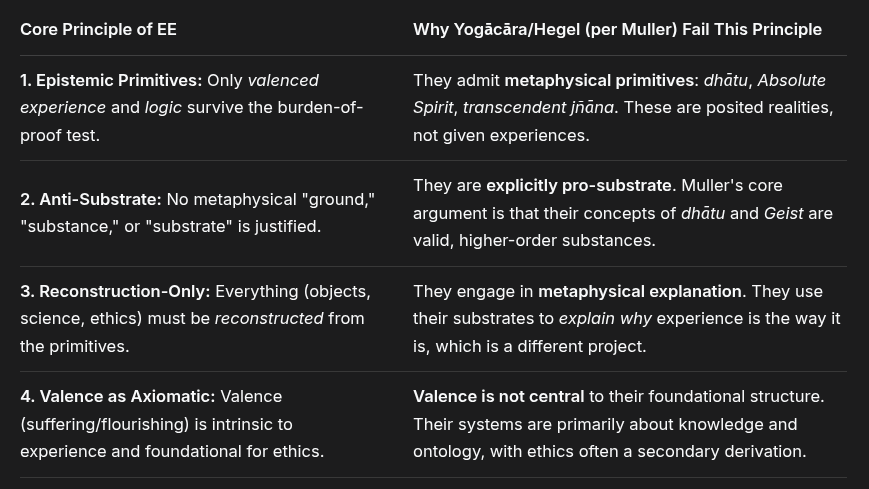

# EE Segment transcript

## Machine transcription

Core Principle of EE

1. Epistemic Primitives: Only valenced
experience and logic survive the burden-of-
proof test.

2. Anti-Substrate: No metaphysical "ground,"
"substance," or "substrate” is justified.

3. Reconstruction-Only: Everything (objects,
science, ethics) must be reconstructed from
the primitives.

4. Valence as Axiomatic: Valence
(suffering/flourishing) is intrinsic to
experience and foundational for ethics.

Why Yogacara/Hegel (per Muller) Fail This Principle

They admit metaphysical primitives: dhdtu, Absolute
Spirit, transcendent jadna. These are posited realities,
not given experiences.

They are explicitly pro-substrate. Muller's core
argument is that their concepts of dhatu and Geist are
valid, higher-order substances.

They engage in metaphysical explanation. They use
their substrates to explain why experience is the way it
is, which is a different project.

Valence i not central to their foundational structure.
Their systems are primarily about knowledge and
ontology, with ethics often a secondary derivation.
