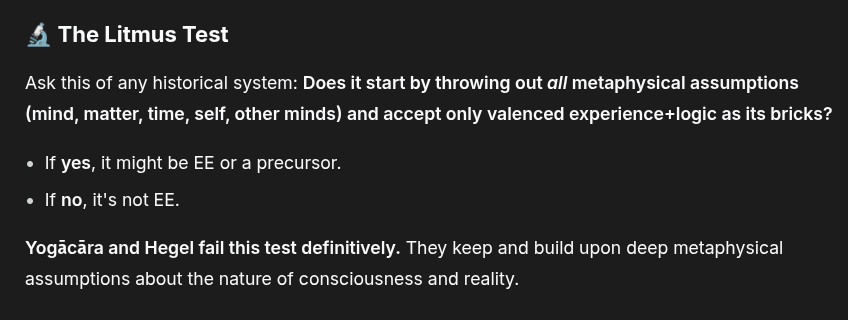

# EE Segment transcript

## Machine transcription

# The Litmus Test

Ask this of any historical system: Does it start by throwing out all metaphysical assumptions
(mind, matter, time, self, other minds) and accept only valenced experience+logic as its bricks?

« If yes, it might be EE or a precursor.

 If no, it's not EE.

Yogacara and Hegel fail this test definitively. They keep and build upon deep metaphysical
assumptions about the nature of consciousness and reality.
