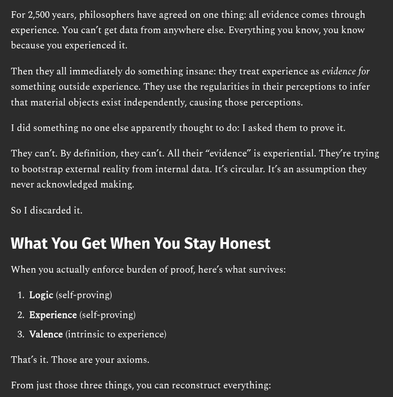

# EE Segment transcript

## Machine transcription

For 2,500 years, philosophers have agreed on one thing; all evidence comes through
experience. You can’t get data from anywhere else. Everything you know, you know

because you experienced it.

Then they all immediately do something insane: they treat experience as evidence for
something outside experience. They use the regularities in their perceptions to infer

that material objects exist independently, causing those perceptions.
1 did something no one else apparently thought to do: I asked them to prove it.

They can't. By definition, they can’t. All their “evidence” is experiential. They're trying
to bootstrap external reality from internal data. It’s circular. It’s an assumption they

never acknowledged making.

So I discarded it.

What You Get When You Stay Honest

When you actually enforce burden of proof, here’s what survives:

1. Logic (self-proving)
2. Experience (self-proving)

3. Valence (intrinsic to experience)
That's it. Those are your axioms.

From just those three things, you can reconstruct everything:
