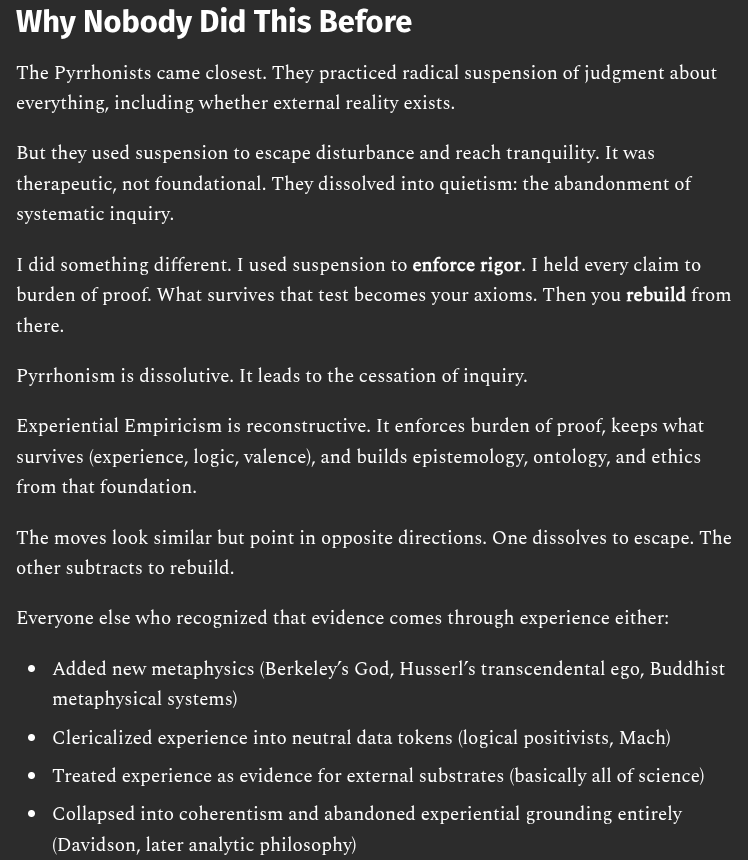

# EE Segment transcript

## Machine transcription

Why Nobody Did This Before

The Pyrrhonists came closest. They practiced radical suspension of judgment about
everything, including whether external reality exists.

But they used suspension to escape disturbance and reach tranquility. It was
therapeutic, not foundational. They dissolved into quietism: the abandonment of
systematic inquiry.

1 did something different. I used suspension to enforce rigor. I held every claim to
burden of proof. What survives that test becomes your axioms. Then you rebuild from

there.
Pyrrhonism is dissolutive. It leads to the cessation of inquiry.

Experiential Empiricism is reconstructive. It enforces burden of proof, keeps what
survives (experience, logic, valence), and builds epistemology, ontology, and ethics
from that foundation.

The moves look similar but point in opposite directions. One dissolves to escape. The
other subtracts to rebuild.

Everyone else who recognized that evidence comes through experience either:
o Added new metaphysics (Berkeley’s God, Husserl’s transcendental ego, Buddhist
metaphysical systems)
® Clericalized experience into neutral data tokens (logical positivists, Mach)

* Treated experience as evidence for external substrates (basically all of science)

* Collapsed into coherentism and abandoned experiential grounding entirely

(Davidson, later analytic philosophy)
