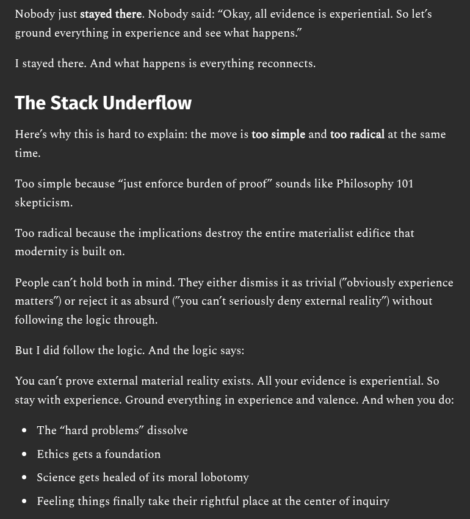

# EE Segment transcript

## Machine transcription

Nobody just stayed there. Nobody said: “Okay, all evidence is experiential. So let’s

ground everything in experience and see what happens.”

I stayed there. And what happens is everything reconnects.

The Stack Underflow

Here's why this is hard to explain: the move is too simple and too radical at the same

time.

Too simple because “just enforce burden of proof” sounds like Philosophy 101

skepticism.

Too radical because the implications destroy the entire materialist edifice that

modernity is built on.

People can’t hold both in mind. They either dismiss it as trivial (“obviously experience
matters”) or reject it as absurd (“you can’t seriously deny external reality”) without

following the logic through.
But I did follow the logic. And the logic says:

You can’t prove external material reality exists. All your evidence is experiential. So
stay with experience. Ground everything in experience and valence. And when you do:
e The “hard problems” dissolve

* Ethics gets a foundation
* Science gets healed of its moral lobotomy

® Feeling things finally take their rightful place at the center of inquiry
