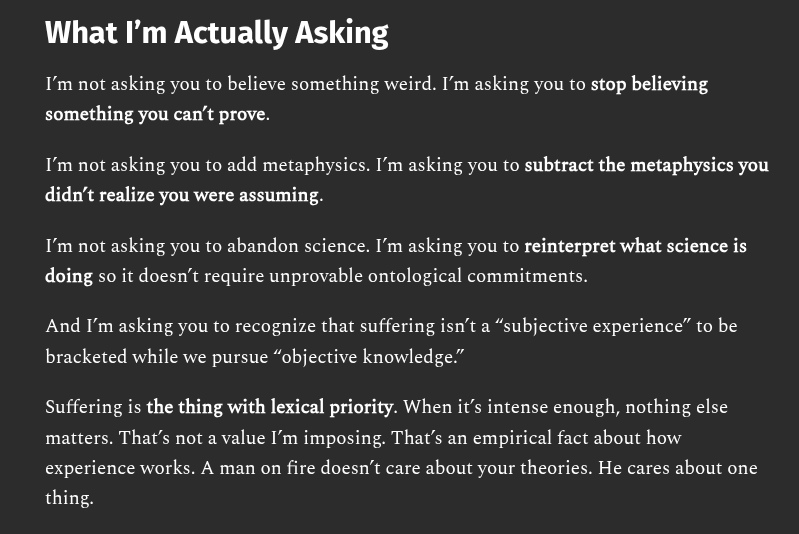

# EE Segment transcript

## Machine transcription

What I'm Actually Asking

I'm not asking you to believe something weird. I'm asking you to stop believing

something you can't prove.

I'm not asking you to add metaphysics. I'm asking you to subtract the metaphysics you
didn't realize you were assuming.

I'm not asking you to abandon science. I'm asking you to reinterpret what science is

doing so it doesn't require unprovable ontological commitments.

And I'm asking you to recognize that suffering isn’t a “subjective experience” to be

bracketed while we pursue “objective knowledge.”

Suffering is the thing with lexical priority. When it’s intense enough, nothing else
matters. That's not a value I'm imposing. That’s an empirical fact about how
experience works. A man on fire doesn’t care about your theories. He cares about one
thing.
