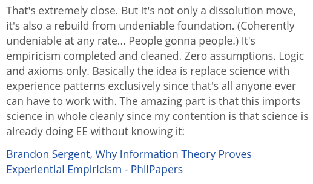

# EE Segment transcript

## Machine transcription

That's extremely close. But it's not only a dissolution move,
it's also a rebuild from undeniable foundation. (Coherently
undeniable at any rate... People gonna people.) It's
empiricism completed and cleaned. Zero assumptions. Logic
and axioms only. Basically the idea is replace science with
experience patterns exclusively since that's all anyone ever
can have to work with. The amazing part is that this imports
science in whole cleanly since my contention is that science is
already doing EE without knowing it:

Brandon Sergent, Why Information Theory Proves
Experiential Empiricism - PhilPapers
