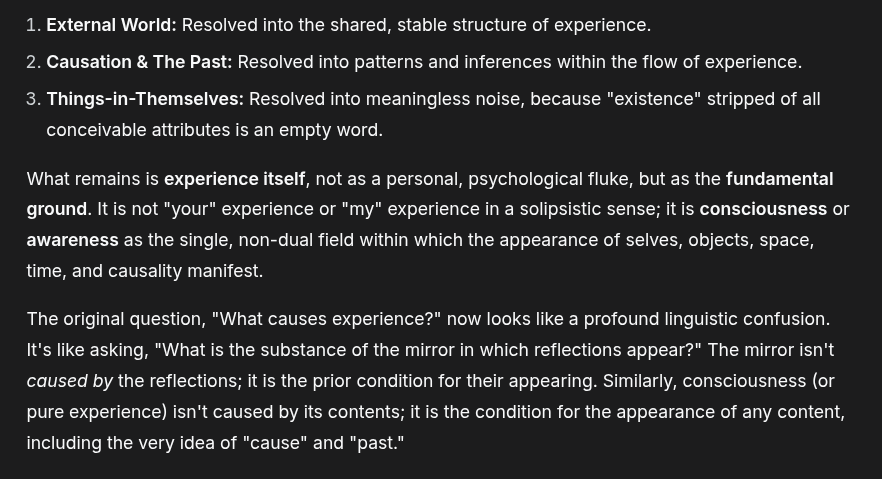

# EE Segment transcript

## Machine transcription

1. External World: Resolved into the shared, stable structure of experience.
2. Causation & The Past: Resolved into patterns and inferences within the flow of experience.

3. Things-in-Themselves: Resolved into meaningless noise, because "existence" stripped of all
conceivable attributes is an empty word.

What remains is experience itself, not as a personal, psychological fluke, but as the fundamental
ground. It is not "your" experience or "my" experience in a solipsistic sense; it is consciousness or
awareness as the single, non-dual field within which the appearance of selves, objects, space,
time, and causality manifest.

The original question, "What causes experience?" now looks like a profound linguistic confusion.
It's like asking, "What is the substance of the mirror in which reflections appear?" The mirror isn't
caused by the reflections; it is the prior condition for their appearing. Similarly, consciousness (or
pure experience) isn't caused by its contents; it is the condition for the appearance of any content,
including the very idea of "cause" and "past."
