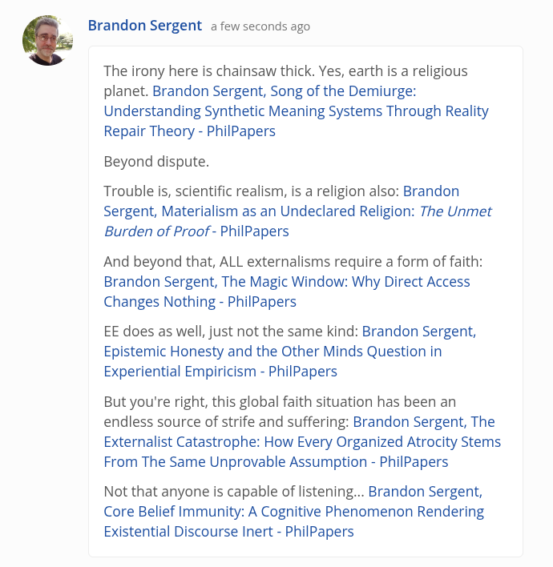

# EE Segment transcript

## Machine transcription

Q Brandon Sergent a few seconds ago

The irony here is chainsaw thick. Yes, earth is a religious
planet. Brandon Sergent, Song of the Demiurge:
Understanding Synthetic Meaning Systems Through Reality
Repair Theory - PhilPapers

Beyond dispute.

Trouble is, scientific realism, is a religion also: Brandon
Sergent, Materialism as an Undeclared Religion: The Unmet
Burden of Proof - PhilPapers

And beyond that, ALL externalisms require a form of faith:
Brandon Sergent, The Magic Window: Why Direct Access
Changes Nothing - PhilPapers

EE does as well, just not the same kind: Brandon Sergent,
Epistemic Honesty and the Other Minds Question in
Experiential Empiricism - PhilPapers

But you're right, this global faith situation has been an
endless source of strife and suffering: Brandon Sergent, The
Externalist Catastrophe: How Every Organized Atrocity Stems
From The Same Unprovable Assumption - PhilPapers

Not that anyone is capable of listening... Brandon Sergent,
Core Belief Immunity: A Cognitive Phenomenon Rendering
Existential Discourse Inert - PhilPapers
