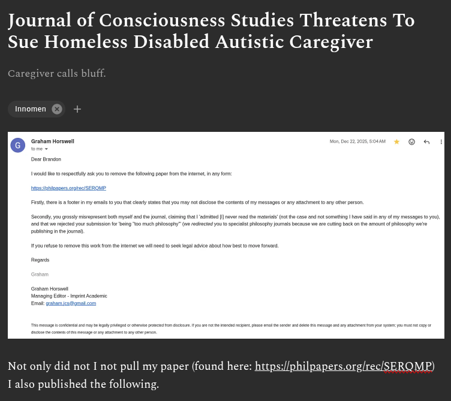

# EE Segment transcript

## Machine transcription

Journal of Consciousness Studies Threatens To
Sue Homeless Disabled Autistic Caregiver

cal

Innomen

Not only did not I not pull my paper (found here: https://philpapers.org/rec/SERQMP)

Lalso published the following.
