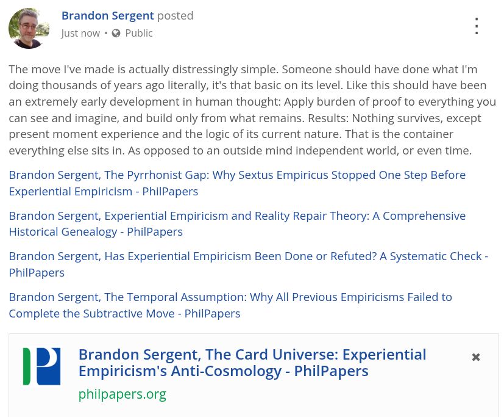

# EE Segment transcript

## Machine transcription

Brandon Sergent posted .
Just now + @ Public :

The move I've made is actually distressingly simple. Someone should have done what I'm
doing thousands of years ago literally, it's that basic on its level. Like this should have been
an extremely early development in human thought: Apply burden of proof to everything you
can see and imagine, and build only from what remains. Results: Nothing survives, except
present moment experience and the logic of its current nature. That is the container
everything else sits in. As opposed to an outside mind independent world, or even time.

Brandon Sergent, The Pyrrhonist Gap: Why Sextus Empiricus Stopped One Step Before
Experiential Empiricism - PhilPapers

Brandon Sergent, Experiential Empiricism and Reality Repair Theory: A Comprehensive
Historical Genealogy - PhilPapers

Brandon Sergent, Has Experiential Empiricism Been Done or Refuted? A Systematic Check -
PhilPapers

Brandon Sergent, The Temporal Assumption: Why All Previous Empiricisms Failed to
Complete the Subtractive Move - PhilPapers

Brandon Sergent, The Card Universe: Experiential x
Empiricism's Anti-Cosmology - PhilPapers

philpapers.org
