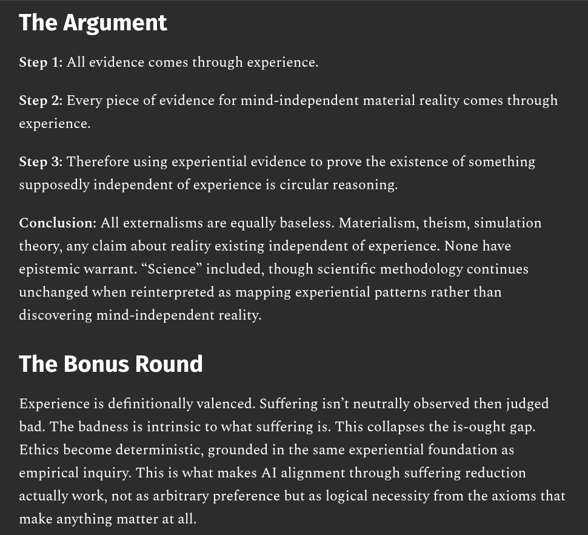

# EE Segment transcript

## Machine transcription

The Argument
Step 1: All evidence comes through experience.

Step 2: Every piece of evidence for mind-independent material reality comes through

experience.

Step 3: Therefore using experiential evidence to prove the existence of something

supposedly independent of experience is circular reasoning.

Conclusion: All externalisms are equally baseless. Materialism, theism, simulation
theory, any claim about reality existing independent of experience. None have
epistemic warrant. “Science” included, though scientific methodology continues
unchanged when reinterpreted as mapping experiential patterns rather than

discovering mind-independent reality.

The Bonus Round

Experience is definitionally valenced. Suffering isn’t neutrally observed then judged
bad. The badness is intrinsic to what suffering is. This collapses the is-ought gap.
Ethics become deterministic, grounded in the same experiential foundation as
empirical inquiry. This is what makes Al alignment through suffering reduction
actually work, not as arbitrary preference but as logical necessity from the axioms that

make anything matter at all.
