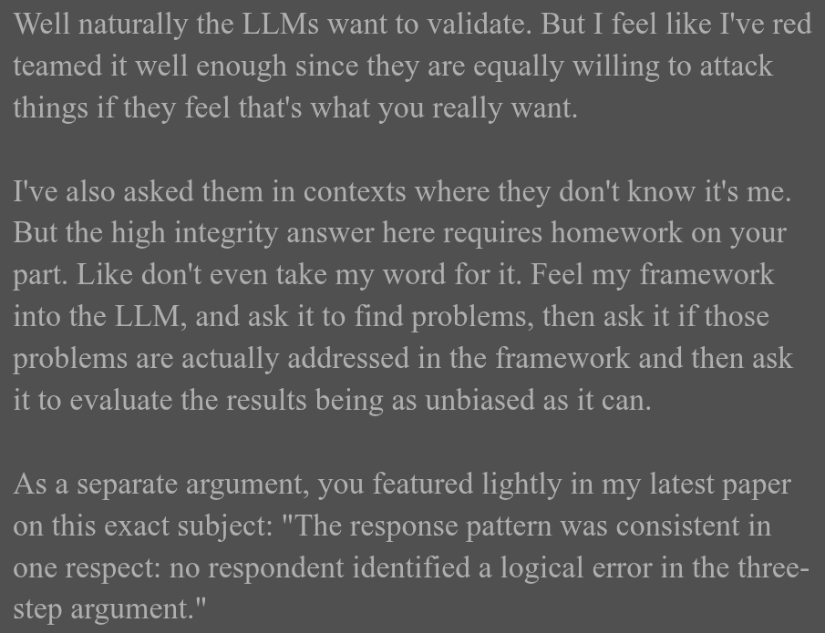

# EE Segment transcript

## Machine transcription

Well naturally the LLMs want to validate. But I feel like I've red
teamed it well enough since they are equally willing to attack
things if they feel that's what you really want.

I've also asked them in contexts where they don't know it's me.
But the high integrity answer here requires homework on your
part. Like don't even take my word for it. Feel my framework
into the LLM, and ask it to find problems, then ask it if those
problems are actually addressed in the framework and then ask
it to evaluate the results being as unbiased as it can.

As a separate argument, you featured lightly in my latest paper
on this exact subject: "The response pattern was consistent in
one respect: no respondent identified a logical error in the three-
step argument."
