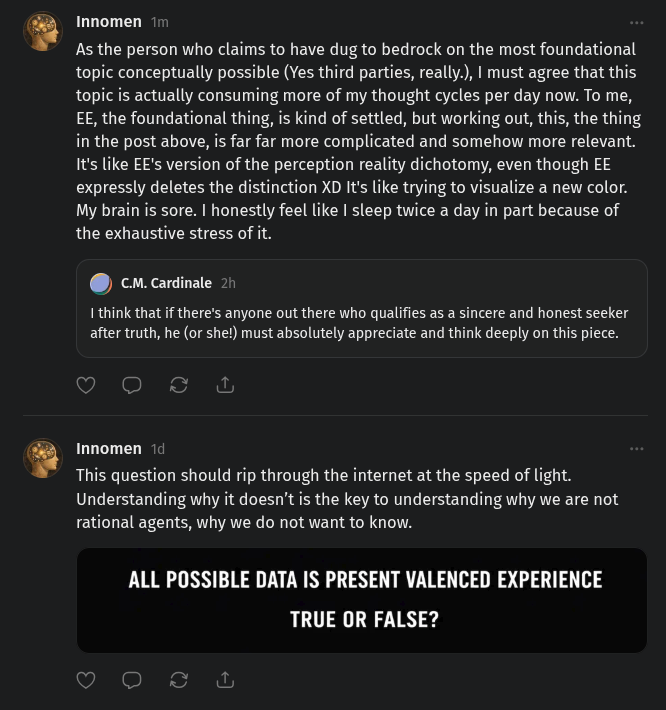

# EE Segment transcript

## Machine transcription

Innomen 1

As the person who claims to have dug to bedrock on the most foundational
topic conceptually possible (Yes third parties, really.), | must agree that this.
topic is actually consuming more of my thought cycles per day now. To me,
EE, the foundational thing, is kind of settled, but working out, this, the thing
in the post above, is far far more complicated and somehow more relevant.
It's like EE's version of the perception reality dichotomy, even though EE
expressly deletes the distinction XD It's like trying to visualize a new color.
My brain is sore. | honestly feel like | sleep twice a day in part because of
the exhaustive stress of it.

@ cm.cardinale 21

I think that if there’s anyone out there who qualifies as a sincere and honest seeker
after truth, he (or shet) must absolutely appreciate and think deeply on this piece.

Innomen 14

This question should rip through the internet at the speed of light.
Understanding why it doesn't is the key to understanding why we are not
rational agents, why we do not want to know.

ALL POSSIBLE DATA IS PRESENT VALENCED EXPERIENCE
TRUE OR FALSE?
