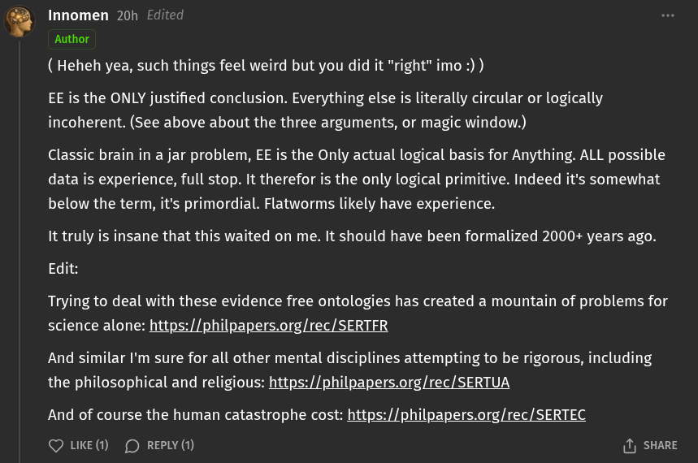

# EE Segment transcript

## Machine transcription

'@ Innomen 20h Edited
Author

( Heheh yea, such things feel weird but you did it "right" imo :) )

EE is the ONLY justified conclusion. Everything else is literally circular or logically
incoherent. (See above about the three arguments, or magic window.)

Classic brain in a jar problem, EE is the Only actual logical basis for Anything. ALL possible
data is experience, full stop. It therefor is the only logical primitive. Indeed it's somewhat
below the term, it's primordial. Flatworms likely have experience.

It truly is insane that this waited on me. It should have been formalized 2000+ years ago.
Edit:

Trying to deal with these evidence free ontologies has created a mountain of problems for
science alone: https://philpapers.org/rec/SERTFR

And similar I'm sure for all other mental disciplines attempting to be rigorous, including
the philosophical and religious: https://philpapers.org/rec/SERTUA

And of course the human catastrophe cost: https://philpapers.org/rec/SERTEC

Q UKE() (D REPLY (1) () SHARE
