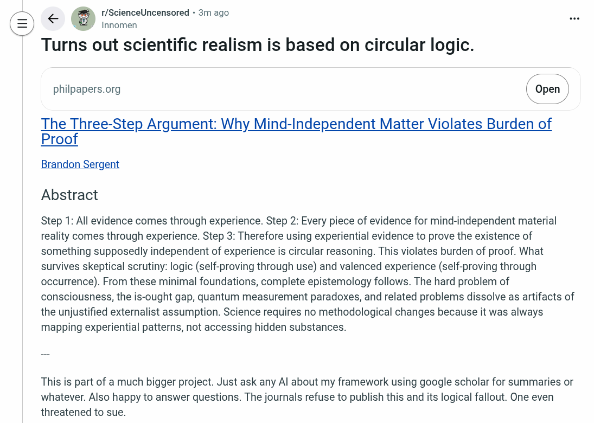

# EE Segment transcript

## Machine transcription

r/Sci U d - 31
Turns out scientific realism is based on circular logic.

r/ \\
philpapers.org | Open |
AN /

The Three-Step Argument: Why Mind-Independent Matter Violates Burden of
Proof

Brandon Sergent

Abstract

Step 1: All evidence comes through experience. Step 2: Every piece of evidence for mind-independent material
reality comes through experience. Step 3: Therefore using experiential evidence to prove the existence of
something supposedly independent of experience is circular reasoning. This violates burden of proof. What
survives skeptical scrutiny: logic (self-proving through use) and valenced experience (self-proving through
occurrence). From these minimal foundations, complete epistemology follows. The hard problem of
consciousness, the is-ought gap, quantum measurement paradoxes, and related problems dissolve as artifacts of
the unjustified externalist assumption. Science requires no methodological changes because it was always
mapping experiential patterns, not accessing hidden substances.

This is part of a much bigger project. Just ask any Al about my framework using google scholar for summaries or
whatever. Also happy to answer questions. The journals refuse to publish this and its logical fallout. One even
threatened to sue.
