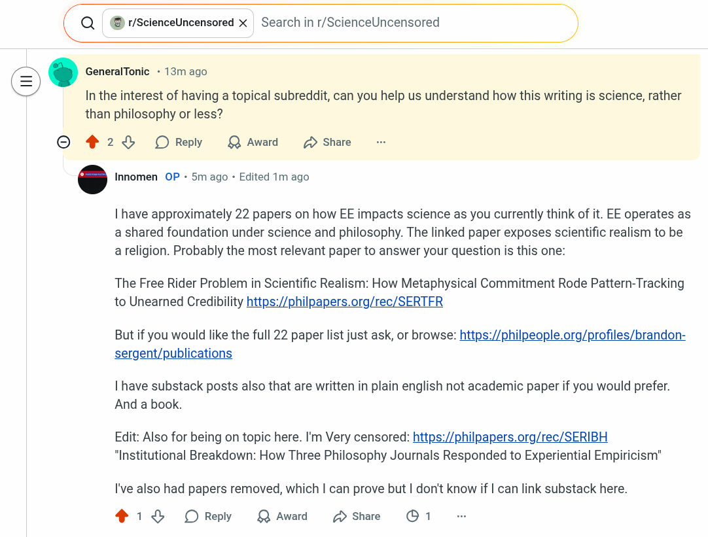

# EE Segment transcript

## Machine transcription

<Q @) r/ScienceUncensored X | Search in r/ScienceUncensored )

@ ‘ GeneralTonic - 13m ago

In the interest of having a topical subreddit, can you help us understand how this writing is science, rather
than philosophy or less?

O 2% OReply Q Award 2 Share

‘ Innomen OP - 5m ago - Edited 1m ago

| have approximately 22 papers on how EE impacts science as you currently think of it. EE operates as
a shared foundation under science and philosophy. The linked paper exposes scientific realism to be
areligion. Probably the most relevant paper to answer your question is this one:

The Free Rider Problem in Scientific Realism: How Metaphysical Commitment Rode Pattern-Tracking
to Unearned Credibility https:/philpapers.org/rec/SERTFR

But if you would like the full 22 paper list just ask, or browse: https:/philpeople.org/profiles/brandon-
sergent/publications

| have substack posts also that are written in plain english not academic paper if you would prefer.
And a book.

Edit: Also for being on topic here. I'm Very censored: https:/philpapers.org/rec/SERIBH
"Institutional Breakdown: How Three Philosophy Journals Responded to Experiential Empiricism"

I've also had papers removed, which | can prove but | don't know if | can link substack here.

21 OReply QAward DShare O 1
