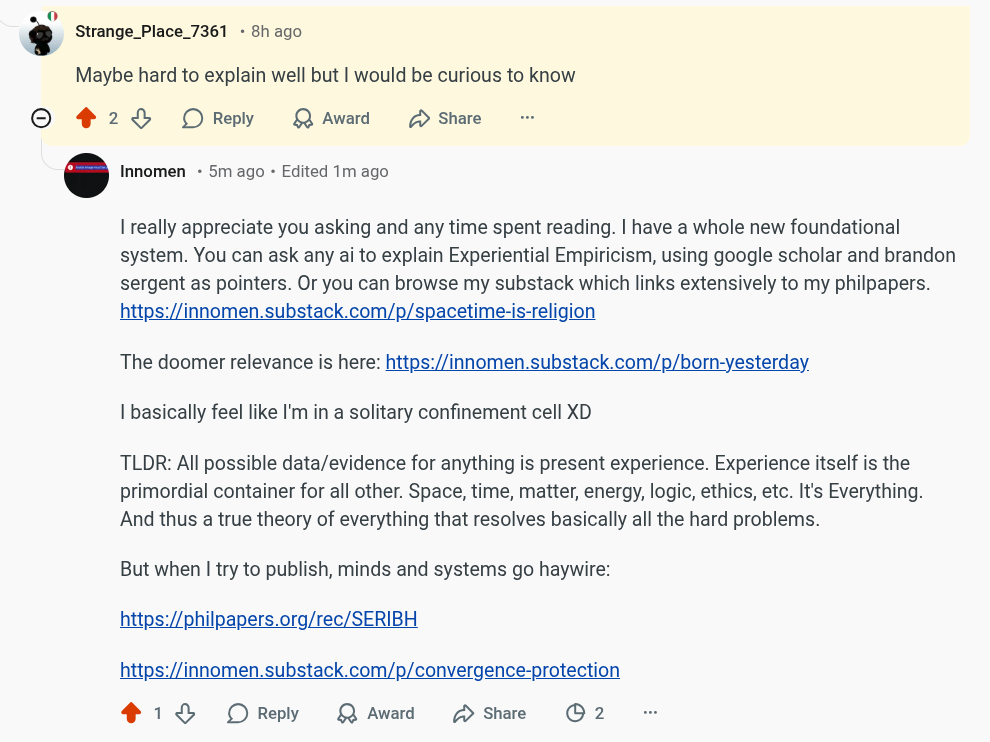

# EE Segment transcript

## Machine transcription

0
* Strange_Place_7361 - 8h ago
Maybe hard to explain well but | would be curious to know

O 42% OReply L Award (D Share

‘ Innomen - 5m ago - Edited 1m ago

1 really appreciate you asking and any time spent reading. | have a whole new foundational
system. You can ask any ai to explain Experiential Empiricism, using google scholar and brandon
sergent as pointers. Or you can browse my substack which links extensively to my philpapers.
https://innomen.substack.com/p/spacetime-is-religion

The doomer relevance is here: https://innomen.substack.com/p/born-yesterday.
| basically feel like I'm in a solitary confinement cell XD

TLDR: All possible data/evidence for anything is present experience. Experience itself is the
primordial container for all other. Space, time, matter, energy, logic, ethics, etc. It's Everything.
And thus a true theory of everything that resolves basically all the hard problems.

But when | try to publish, minds and systems go haywire:

https://philpapers.org/rec/SERIBH

https://innomen.substack.com/p/convergence-protection
218 OReply QAward D sShare O 2
